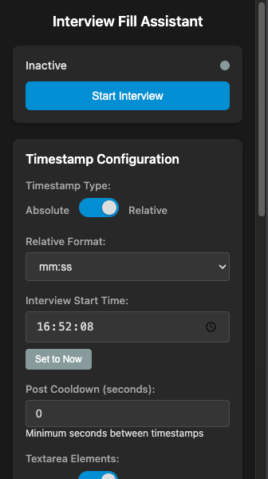

# Interview Fill Assistant

A Chrome extension that assists in documenting interviews and forms in real time with automatic timestamp functionality.

## Features

- **Automatic Timestamping**: After typing a line break, the next non-whitespace character is automatically prefixed with a timestamp
- **Configurable Timestamp Formats**: 
  - Absolute time (HH:mm:ss, HH:mm, or locale format)
  - Relative time from interview start (mm:ss or seconds only)
- **Interview Controls**: Start/stop interview sessions with configurable start times
- **Real-time Timer Display**: Visual timer showing elapsed interview time
- **Input Type Configuration**: Toggle support for textarea elements and input boxes separately
- **Post Cooldown**: Configurable delay between timestamps to prevent spam
- **Theme Support**: Automatic light/dark mode with manual override
- **Tab-Specific Activation**: Only active in the tab where interview was started
- **Real-time Processing**: Works on any webpage with text inputs, textareas, and contenteditable elements

## Installation

1. Download or clone this repository
2. Open Chrome and navigate to `chrome://extensions/`
3. Enable "Developer mode" in the top right corner
4. Click "Load unpacked" and select the extension directory
5. The extension icon should appear in your Chrome toolbar

## Usage

1. **Start an Interview**: Click the extension icon and press "Start Interview"
2. **Configure Settings**: Set timestamp format, timer display, input types, and cooldown
3. **Begin Typing**: Navigate to any webpage with text inputs and start typing
4. **Automatic Timestamps**: After pressing Enter, the next non-whitespace character will be prefixed with a timestamp

## Configuration Options

### Timestamp Types
- **Absolute Time**: Shows actual time (e.g., [14:30:25])
- **Relative Time**: Shows time elapsed since interview start (e.g., [+05:30])

### Time Formats
- **HH:mm:ss**: 24-hour format with seconds
- **HH:mm**: 24-hour format without seconds  
- **Locale Format**: Uses system locale time format
- **mm:ss**: Minutes and seconds for relative time
- **Seconds Only**: Just elapsed seconds for relative time

### Timer Display
- **Show Timer**: Toggle to enable/disable the visual timer
- **Timer Position**: Choose from top-right, top-left, bottom-right, bottom-left, or over focused input
- **Timer Format**: Always shows elapsed time in mm:ss format

### Input Types
- **Textarea Elements**: Toggle support for `<textarea>` elements
- **Input Boxes**: Toggle support for `<input type="text">` elements
- **Contenteditable**: Always supported (Google Docs, rich text editors)

### Advanced Settings
- **Post Cooldown**: Minimum seconds between timestamps (0-300 seconds)
- **Theme Mode**: Auto (follow system), Light, or Dark theme
- **Interview Start Time**: Set custom start time or use current time

## How It Works

The extension monitors text input events across all webpages. When you:
1. Press Enter (line break) OR start typing in an empty field
2. Type the next non-whitespace character

The extension automatically inserts a timestamp at the beginning of that line.

## Supported Elements

- `<textarea>` elements (configurable)
- `<input type="text">` elements (configurable)

## Privacy

This extension:
- Only processes text input events locally in your browser
- Does not send any data to external servers
- Stores configuration settings locally using `chrome.storage` API
- Works entirely offline

## Development & Joining
Pull requests may be considered for adding new features, fixing issues, and even restructuring the code.

## License

MIT License - feel free to modify and distribute.
